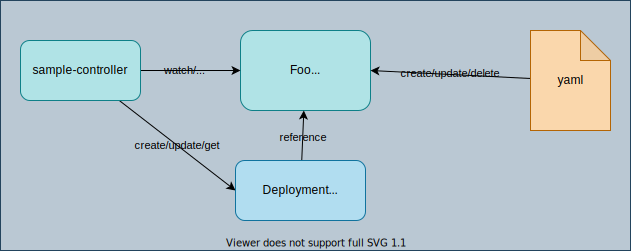

## About Sample Controller

[Sample Controller](https://github.com/kubernetes/sample-controller/) is an example Kubernetes controller in the Kubernetes project, with which you can learn about how Kubernetes controller is implemented and how it works.

## About this Doc

Although the official repository is very helpful to understand a Kubernetes controller, it is still quite hard to read the source codes and implement it by yourself, especially for a newbie. So, I broke down the complete codes into steps in this repository ([nakamasato/sample-controller](https://github.com/nakamasato/sample-controller)) so anybody can create the example controller step by step from scratch.

I hope this documentation will be helpful to open the door to the world of Kubernetes operator.
