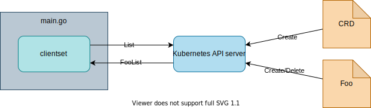

## [4. Checkpoint: Check custom resource and codes](https://github.com/nakamasato/sample-controller/commit/48454d52dbacd904282c9aef7962c0bacd25d123)

### 4.1. Overview



- [x] Create `CustomResourceDefinition` `foos.example.com`.
- [x] Create `Foo` object.
- [x] Read the `Foo` object from `main.go`.

### 4.2. Implement

1. Create main.go.

    ```go
    package main

    func main() {

    }
    ```

1. Init [k8s.io/klog/v2](https://pkg.go.dev/k8s.io/klog/v2)
    ```go
    import (
        "k8s.io/klog/v2"
    )
    ```

    ```go
    klog.InitFlags(nil)
    ```

1. Set `kubeconfig` from [flag](https://pkg.go.dev/flag).

    If home is detected, use `~/.kube/config` as default, otherwise, `-kubeconfig` argument is required.

    ```go
    import (
        "flag"
        "path/filepath"
        ...
        "k8s.io/client-go/util/homedir"
    )
    ```

    ```go
    var kubeconfig *string
    if home := homedir.HomeDir(); home != "" {
        kubeconfig = flag.String("kubeconfig", filepath.Join(home, ".kube", "config"), "(optional)")
    } else {
        kubeconfig = flag.String("kubeconfig", "", "absolute path to kubeconfig file")
    }
    flag.Parse()
    ```

1. Set config for Kubernetes client with [client-go/tools/clientcmd](https://pkg.go.dev/k8s.io/client-go/tools/clientcmd)

    config is *[restclient.Config](https://pkg.go.dev/k8s.io/client-go@v0.24.3/rest#Config)

    ```go
    import (
        ...
        "k8s.io/client-go/tools/clientcmd"
    )
    ```

    ```go
    config, err := clientcmd.BuildConfigFromFlags("", *kubeconfig)
    if err != nil {
        klog.Fatalf("Error building kubeconfig: %s", err.Error())
    }
    ```

1. Initialize clientset for our custom resource.

    ```go
    import (
        clientset "github.com/nakamasato/sample-controller/pkg/generated/clientset/versioned"
    )
    ```

    ```go
    exampleClient, err := clientset.NewForConfig(config)
    if err != nil {
        klog.Fatalf("Error building example clientset: %s", err.Error())
    }
    ```

1. List the custom resource `Foo`.

    ```go
    import (
        metav1 "k8s.io/apimachinery/pkg/apis/meta/v1"
    )
    ```

    ```go
    foos, err := exampleClient.ExampleV1alpha1().Foos("").List(context.Background(), metav1.ListOptions{})
    if err != nil {
        klog.Fatalf("listing foos %s %s", err.Error())
    }
    klog.Infof("length of foos is %d", len(foos.Items))
    ```

Final `main.go`:

```go
package main

import (
    "context"
    "flag"
    "path/filepath"

    "k8s.io/client-go/tools/clientcmd"
    "k8s.io/client-go/util/homedir"
    "k8s.io/klog/v2"

    clientset "github.com/nakamasato/sample-controller/pkg/generated/clientset/versioned"
    metav1 "k8s.io/apimachinery/pkg/apis/meta/v1"
)

func main() {
    klog.InitFlags(nil)

    var kubeconfig *string
    if home := homedir.HomeDir(); home != "" {
        kubeconfig = flag.String("kubeconfig", filepath.Join(home, ".kube", "config"), "(optional)")
    } else {
        kubeconfig = flag.String("kubeconfig", "", "absolute path to kubeconfig file")
    }
    flag.Parse()

    config, err := clientcmd.BuildConfigFromFlags("", *kubeconfig)
    if err != nil {
        klog.Fatalf("Error building kubeconfig: %s", err.Error())
    }

    exampleClient, err := clientset.NewForConfig(config)
    if err != nil {
        klog.Fatalf("Error building example clientset: %s", err.Error())
    }

    foos, err := exampleClient.ExampleV1alpha1().Foos("").List(context.Background(), metav1.ListOptions{})
    if err != nil {
        klog.Fatalf("listing foos %s %s", err.Error())
    }
    klog.Infof("length of foos is %d", len(foos.Items))
}
```

### 4.3. Run and check

1. Build `sample-controller`

    ```
    go mod tidy
    go build
    ```

1. Register the CRD.

    ```
    kubectl apply -f config/crd/foos.yaml
    ```
1. Run sample-controller.

    ```
    ./sample-controller
    ```

    Result: no `Foo` exists

    ```
    length of foos is 0
    ```

1. Create sample foo (custom resource) with `config/sample/foo.yaml`.

    ```yaml
    apiVersion: example.com/v1alpha1
    kind: Foo
    metadata:
        name: foo-sample
    spec:
        deploymentName: foo-sample
        replicas: 1
    ```

    ```
    kubectl apply -f config/sample/foo.yaml
    ```

1. Run the controller again.

    ```
    ./sample-controller
    length of foos is 1
    ```

1. Clean up Foo (custom resource).

    ```
    kubectl delete -f config/sample/foo.yaml
    ```
